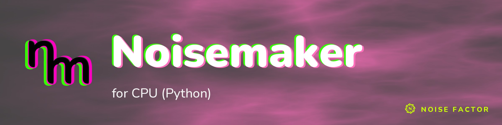

<!-- repo-hero -->
<a href="https://noisemaker.app/"></a>

<sub>Open source from <a href="https://noisefactor.io">Noise Factor</a> &middot; <a href="https://github.com/noisefactorllc">more projects</a></sub>

# noisemaker-for-python

> This package supports the "Export Shader Pipeline" feature in Noisedeck.app. The feature runs shader compositions on other platforms. Noise Factor derives this package from the upstream Noisemaker Engine project and tests it for pixel-level parity.

This is not the classic Python Noisemaker (Composer) library. This is a new
effort centered around software shader execution.

A pure-Python CPU implementation of the [Noisemaker](https://noisemaker.app)
shader engine — the Python port of [`noisemaker-for-cpu`](https://github.com/noisefactorllc/noisemaker-for-cpu).

Effect kernels are **transpiled directly from the upstream GLSL** served by the
`shaders.noisedeck.app` CDN (pinned by version), not hand-maintained. A pure-Python GLSL→Python transpiler (`transpiler/`) lexes, preprocesses, parses, and emits a NumPy-backed kernel per shader pass. A small runtime reproduces the reference engine's float model:

- Float32 vectors.
- Float64 scalar arithmetic.
- Half-float texture quantization.
- Screen-space derivatives.
- Bit-exact uint32/PCG hashing.

**The current bundle contains 205 CPU catalog effects.** The earlier 188-effect bundle documented byte parity with the JavaScript engine's `effect` CLI for its 167 single-frame effects. It also documented exact JS CPU DSL parity for its 21 stateful and particle effects at controlled iteration counts.
Iterated effects default to `iterationCount: 60`. Particle pipelines share state from `pointsEmit()` through their point and render steps.

## Install

```bash
pip install -e ".[dev]"      # requires Python 3.11+, numpy, click
```

## Render an effect

CLI (modeled after the [`noisemaker`](https://github.com/noisefactorllc/noisemaker) CLI):

```bash
# generate a single frame
noisemaker-py generate synth/curl --width 512 --height 512 --filename curl.png
noisemaker-py generate random --seed 42

# apply an effect to an existing image
noisemaker-py apply filter/chrome photo.png --filename chrome.png

# animate an effect over time (needs ffmpeg for .mp4; or --save-frames DIR)
noisemaker-py animate synth/curl --frame-count 60 --filename curl.mp4
```

Library:

```python
from noisemaker_cpu.renderer import render_effect
from noisemaker_cpu.png import encode_png

surface = render_effect("synth/curl", {"scale": 16}, width=512, height=512, seed=1)
with open("curl.png", "wb") as f:
    f.write(encode_png(surface))
```

## Regenerating the bundle

The vendored kernels + metadata under `src/noisemaker_cpu/bundle/` are generated
from the CDN. To rebuild (requires `json5`):

```bash
pip install -e ".[build]"
python -m transpiler.build --all
```

## Tests

```bash
pytest
```

Cross-language parity against the JS engine (`scripts/parity.py`) needs a sibling
`noisemaker-for-cpu` checkout and Node. The image harness compares 169 effects
with zero byte tolerance and exits unsuccessfully for differences or errors.
It reports 36 iterated and typed effects separately; their DSL cases are in the test suite.

## License

MIT © Noise Factor LLC. See [LICENSE](LICENSE).
